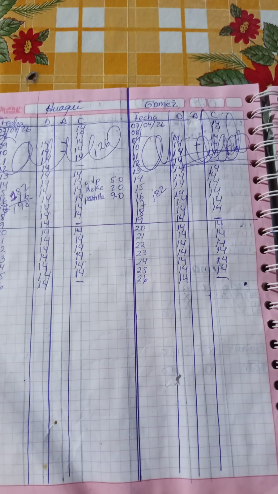
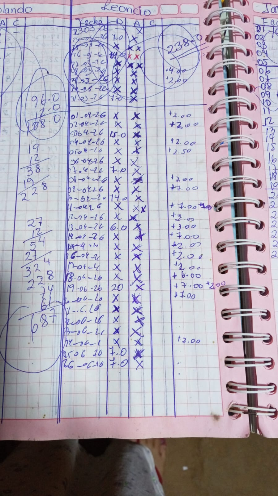
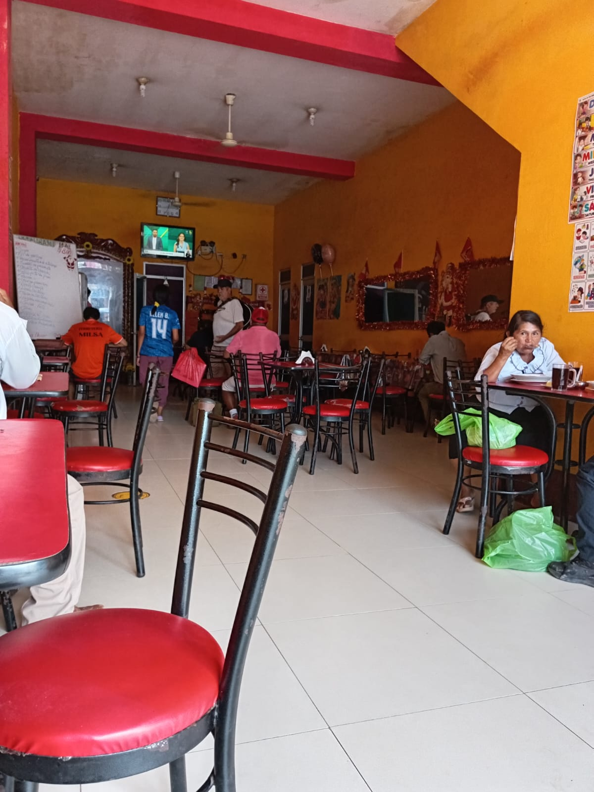
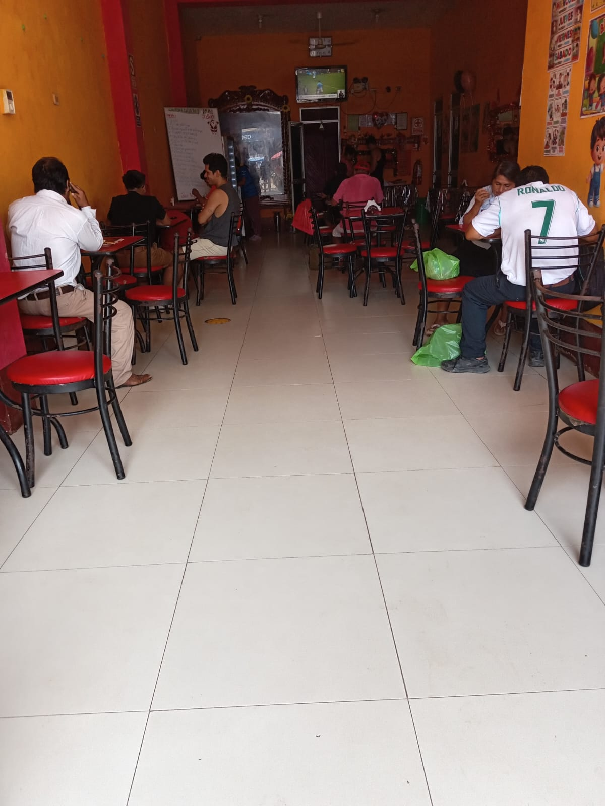

# 🍽️ Sistema de Venta de Comida "KLETA"

Sistema web para la gestión de venta de comida con facilidades de pago diario, semanal y mensual.  
Desarrollado como proyecto final del curso de **PHP Web** en **SENATI**.

---

## Índice

1. [Descripción del Negocio](#1-descripción-del-negocio)
2. [Identificar el Problema y Solución](#2-identificar-el-problema-y-solución)
3. [Preanálisis](#3-preanálisis)
   - [Necesidades](#31-necesidades)
   - [Estudio de Viabilidad](#32-estudio-de-viabilidad)
   - [Alcance del Sistema](#33-alcance-del-sistema)
4. [Análisis](#4-análisis)
   - [Definición de Requisitos](#41-definición-de-requisitos)
     - [Requisitos Funcionales](#requisitos-funcionales)
     - [Requisitos No Funcionales](#requisitos-no-funcionales)
   - [Análisis de Requisitos](#42-análisis-de-requisitos)
5. [Imágenes del Problema](#5-imágenes-del-problema)
6. [Imágenes del Negocio](#6-imágenes-del-negocio)

---

## 1. Descripción del Negocio

| Campo       | Detalle                                              |
|-------------|------------------------------------------------------|
| **Nombre**  | Restaurante Jugería "KLETA"                          |
| **Giro**    | Financiera formal registrada por SUNAT               |
| **Tamaño**  | Pequeña empresa, operación individual o familiar     |

**Contexto:**  
Negocio muy común en el Perú donde una pequeña familia ofrece servicio de comida a personas e instituciones con registro de boletas y facturas, cobrando diariamente, semanalmente o mensualmente, con servicio a domicilio o pedidos con reserva y recojo.

**Justificación:**  
Se necesita un sistema digital para reemplazar el cuaderno manual del cobrador, evitar errores y tener un control claro de cada consumo y pedido de los alimentos.

---

## 2. Identificar el Problema y Solución

### Problema

La persona encargada lleva el registro de ventas y pensionistas en un cuaderno o en papel, lo que genera:

- Errores en los registros
- Pérdida de información
- Dificultad para saber cuánto debe cada cliente
- Falta de control sobre cuántos pensionistas llegaron a comer cada día

### Solución Tecnológica

Desarrollar un sistema web con **PHP** y **MySQL** que permita:

- Registrar clientes
- Gestionar cobros diarios, semanales y mensuales
- Mostrar en todo momento el estado de cada pedido
- Consultar el historial de pagos de cada cliente

---

## 3. Preanálisis

### 3.1 Necesidades

El Restaurante Jugería "KLETA" requiere digitalizar su proceso de gestión de ventas y cobros. Las principales necesidades identificadas son:

- Controlar el consumo diario de cada pedido
- Gestionar cobros en modalidad diaria, semanal y mensual
- Emitir comprobantes de pago (boletas y facturas) conforme a SUNAT
- Registrar pedidos con reserva, recojo y servicio a domicilio
- Consultar el historial de pagos y deudas por cliente
- Saber cuántos pensionistas asistieron en un día determinado

### 3.2 Estudio de Viabilidad

**Viabilidad Técnica:**  
El sistema se desarrollará con tecnologías ampliamente disponibles y de uso libre: **PHP puro** para el backend y **MySQL** como motor de base de datos. El negocio cuenta con al menos un equipo con acceso a navegador web, lo que hace viable el uso de una aplicación web sin necesidad de instalación local.

**Viabilidad Económica:**  
Al tratarse de un proyecto académico desarrollado en SENATI, no se incurre en costos de licencias de software. El mantenimiento futuro puede ser asumido por el mismo desarrollador o un técnico básico, lo que reduce el costo operativo frente a sistemas comerciales.

**Viabilidad Operativa:**  
El sistema está diseñado para ser simple e intuitivo, adaptado al perfil del usuario (cobrador o administrador del negocio familiar). Reemplaza directamente el cuaderno manual sin requerir conocimientos técnicos avanzados.

### 3.3 Alcance del Sistema

El sistema cubrirá las siguientes funcionalidades dentro del contexto del Restaurante Jugería "KLETA":

- **Registro de consumo:** ingreso diario de los platos consumidos por mesa o pedido
- **Gestión de cobros:** registro de pagos diarios, semanales y mensuales con seguimiento de deudas
**Fuera del alcance:**
- Integración con plataformas de pago electrónico (Yape, Plin, etc.)
- App móvil nativa
- Módulo de inventario o control de insumos

---

## 4. Análisis

### 4.1 Definición de Requisitos

#### Requisitos Funcionales

| ID   | Descripción |
|------|-------------|
| RF02 | El sistema debe registrar el consumo diario de cada cliente por fecha |
| RF03 | El sistema debe gestionar cobros en modalidad diaria, semanal y mensual |
| RF04 | El sistema debe mostrar el saldo pendiente de cada cliente en tiempo real |
| RF05 | El sistema debe registrar pagos y generar historial por cliente |
| RF06 | El sistema debe tener un módulo de inicio de sesión para el administrador |

#### Requisitos No Funcionales

| ID    | Descripción |
|-------|-------------|
| RNF01 | El sistema debe ser accesible desde cualquier navegador web moderno |
| RNF02 | La interfaz debe ser simple e intuitiva para usuarios sin conocimientos técnicos |
| RNF03 | El sistema debe responder a las solicitudes en menos de 3 segundos |
| RNF04 | Los datos deben almacenarse de forma segura en una base de datos MySQL |
| RNF05 | El sistema debe estar disponible durante el horario de operación del negocio |
| RNF06 | El código debe seguir buenas prácticas de desarrollo con PHP puro |
| RNF07 | El sistema debe ser escalable para agregar nuevos módulos en el futuro |

### 4.2 Análisis de Requisitos

A partir de los requisitos identificados, se determinan los siguientes módulos principales del sistema:

**Módulo de Consumo Diario**  
Registra qué platos consumió cada cliente en el día, permitiendo al cobrador llevar un control exacto sin usar papel. Se vincula directamente al módulo de cobros para calcular el monto acumulado.

**Módulo de Cobros y Pagos**  
Centraliza el registro de pagos recibidos y genera automáticamente el saldo pendiente por cliente según la modalidad (diaria, semanal o mensual). Incluye historial completo de transacciones.

**Módulo de Pedidos**  
Gestiona los pedidos con reserva anticipada o servicio a domicilio, indicando fecha, hora, dirección de entrega y estado del pedido (pendiente, en preparación, entregado).

**Módulo de Reportes**  
Genera reportes de asistencia diaria, listado de deudores, y resumen de ingresos por período, facilitando la toma de decisiones del administrador del negocio.

---

## 5. Imágenes del Problema

---

## 6. Imágenes del Negocio

---
